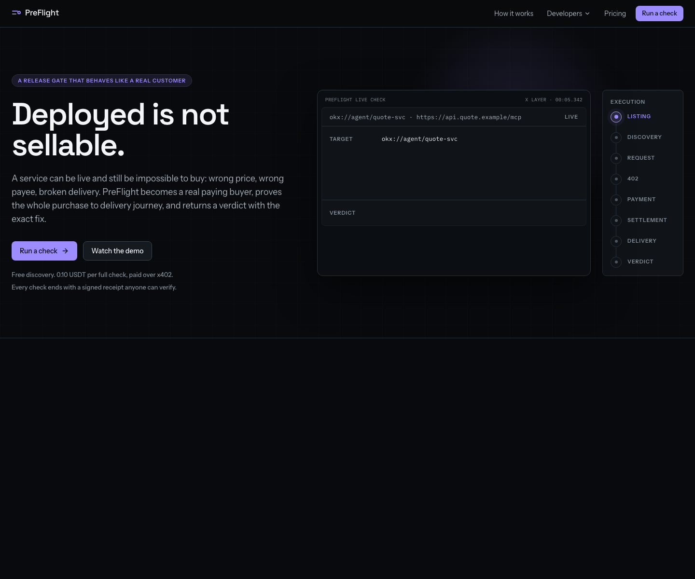
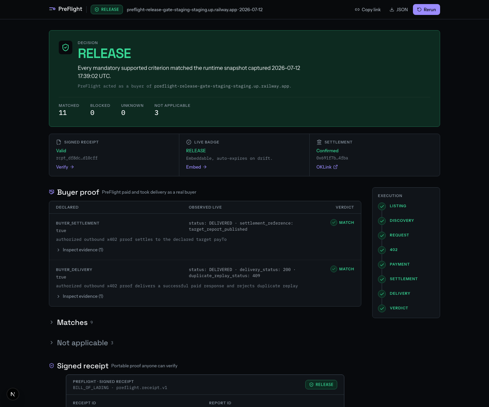
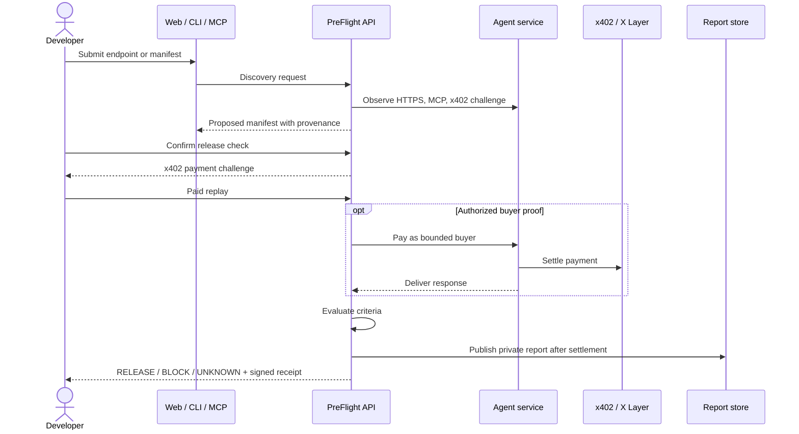
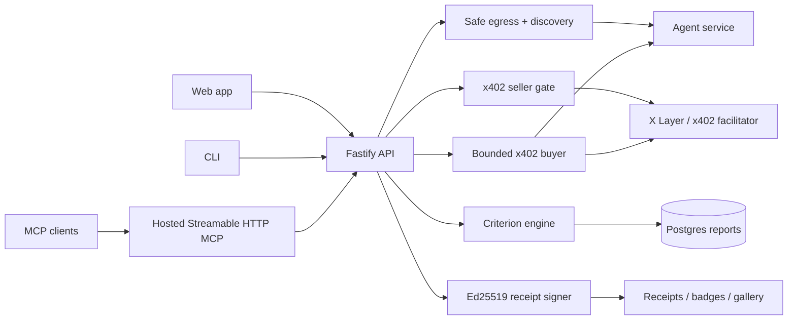
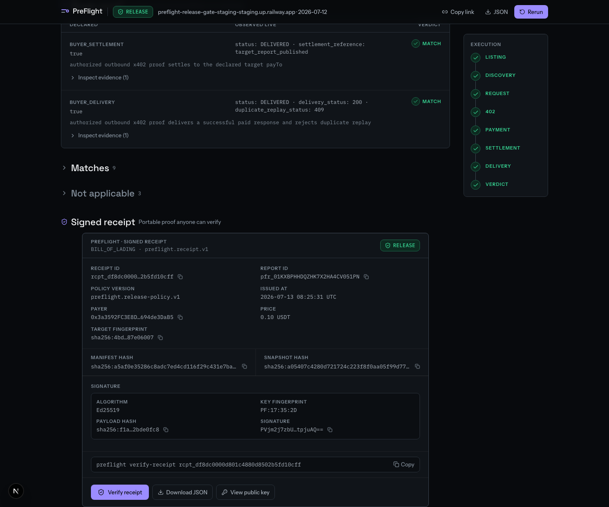

# PreFlight

**A release gate for paid agent services.** PreFlight behaves like a real customer: it discovers a live service, verifies the x402 buyer journey, and returns a criterion-level `RELEASE`, `BLOCK`, or `UNKNOWN` decision with portable signed proof.

[Live product](https://usepreflight.xyz) · [Hosted API](https://api.usepreflight.xyz/api/v1/service) · [API docs](docs/api.md) · [MCP docs](docs/mcp.md) · [CLI](docs/cli.md) · [Receipts](docs/receipts.md)



## Why PreFlight exists

An endpoint being online is not enough. A paid agent service can still fail when a buyer tries to use it:

- the 402 challenge can advertise the wrong network, asset, amount, or `payTo`;
- the declared contract can drift from the live response;
- settlement can succeed while delivery fails;
- a duplicate payment replay can accidentally deliver twice;
- a generic score can hide exactly what has to be fixed.

PreFlight turns that into a release gate. It compares declared intent against observed production behavior, acts as a bounded buyer when authorized, and returns evidence-backed criteria instead of a vague badge.



## How it works



## Key capabilities

- **Discovery-first workflow** — inspect a live endpoint before paying for a full verification.
- **Proposed manifest with provenance** — every inferred field says where it came from and whether it needs confirmation.
- **Real buyer proof** — with owner attestation, PreFlight can pay and take delivery as a bounded buyer.
- **Deterministic decision model** — `RELEASE`, `BLOCK`, or `UNKNOWN`, built from criterion states.
- **Exact remediation** — contradictions include observed evidence and a fix.
- **Signed receipts** — Ed25519 receipt over canonical JSON, verifiable outside the report page.
- **Private reports** — bearer capability tokens; report IDs are not public access.
- **MCP wrapper** — hosted MCP endpoint for agent-native discovery and paid tool invocation.
- **Embeddable badge and gallery** — opt-in proof surfaces for release-ready services.

## Decision model

| Decision | Meaning |
| --- | --- |
| `RELEASE` | Mandatory criteria match the declared release and no blocking contradiction was observed. |
| `BLOCK` | At least one mandatory criterion contradicts the release. |
| `UNKNOWN` | PreFlight could not safely prove the criterion either way. Unknown is honest; it is never silently upgraded. |

Criteria use:

- `MATCH` — observed production behavior matches the declaration;
- `CONTRADICTION` — observed production behavior conflicts with the declaration;
- `UNKNOWN` — not enough safe evidence;
- `NOT_APPLICABLE` — criterion does not apply to this surface.

## Architecture



## Quick start

### Web

Open [usepreflight.xyz](https://usepreflight.xyz), paste a public service endpoint, and review the proposed manifest. Discovery is free; full `verify_release` checks require x402 payment.

### API

```bash
curl -s https://api.usepreflight.xyz/api/v1/service | jq
curl -s https://api.usepreflight.xyz/api/v1/contracts/release-manifest/v1 | jq
```

`POST /api/v1/verify-release` is a paid x402 endpoint. An unpaid request returns an HTTP 402 challenge; a funded agent replays with `PAYMENT-SIGNATURE`.

See [docs/api.md](docs/api.md).

### MCP

PreFlight’s MCP server is hosted; installing the CLI is not required.

```json
{
  "mcpServers": {
    "preflight": {
      "url": "https://api.usepreflight.xyz/mcp"
    }
  }
}
```

See [docs/mcp.md](docs/mcp.md).

### CLI

The CLI is published as `@vinaystwt/preflight-cli` with the `preflight` binary.

Install and smoke-test:

```bash
npm install -g @vinaystwt/preflight-cli
preflight --help
preflight verify --help
preflight verify-receipt --help
```

## Signed receipts

Every completed check can issue a signed receipt:

- payload is canonical JSON with sorted keys;
- payload hash is SHA-256;
- signature algorithm is Ed25519;
- public keys are served at `GET /api/v1/pubkeys`;
- public receipts are served at `GET /api/v1/receipts/{receipt_id}`.



See [docs/cli.md](docs/cli.md) and [docs/receipts.md](docs/receipts.md).

## Security and trust boundaries

PreFlight is a verifier, not a custody product.

- Private reports require capability tokens.
- Reports publish after the required settlement state.
- Probe egress refuses private/internal targets and unsafe redirects.
- Buyer proof requires owner attestation and spend caps.
- Terms-hash drift aborts buyer proof before payment.
- Wallets are separated by role.
- Ambiguous evidence returns `UNKNOWN`, not a false release.

See [docs/security.md](docs/security.md).

## Local development

Backend:

```bash
npm ci
npm run typecheck
npm run build
npm test -- --run
npm run migrate
npm start
```

Web:

```bash
cd web
npm ci
npm run lint
npm run build
npx tsc --noEmit
npx playwright test --reporter=list
```

CLI:

```bash
npm run build --prefix packages/cli
(cd packages/cli && npm pack --dry-run)
```

## Project structure

```text
src/                 Fastify API, MCP, release criteria, payments, receipts
src/db/migrations/   Additive database migrations
web/                 Next.js web application
packages/cli/        CLI package source
docs/                Public API, MCP, receipt, security and operations docs
test/                Backend and release-gate tests
```

## Status and limitations

- Agent ID resolution is intentionally conservative unless an authoritative listing resolver is configured.
- Gallery entries are opt-in.
- Chain anchoring is disabled unless explicitly configured and proven.
- Browser receipt verification may fall back honestly if local Ed25519 support is unavailable.
- The CLI is published as `@vinaystwt/preflight-cli@0.1.0`; keep documented commands limited to verified registry-install behavior.

## License

No public license has been selected yet. Do not assume open-source reuse rights until a license file is added.
