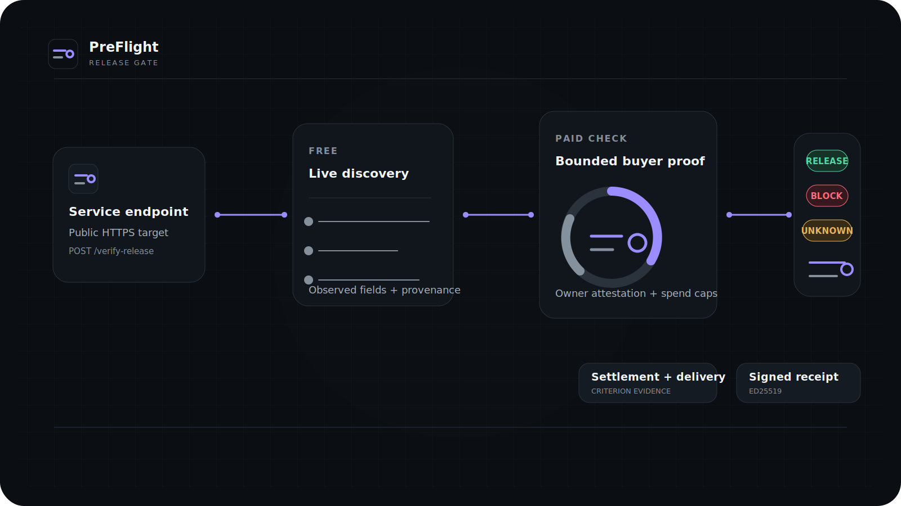
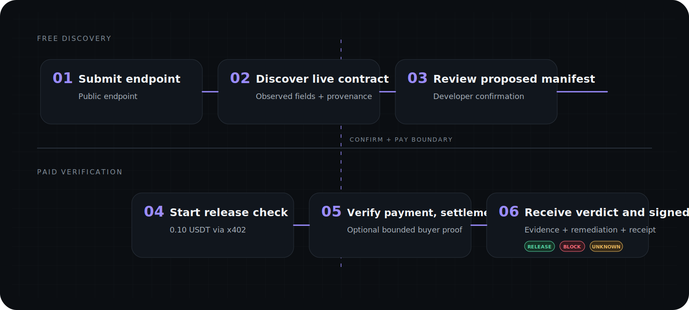
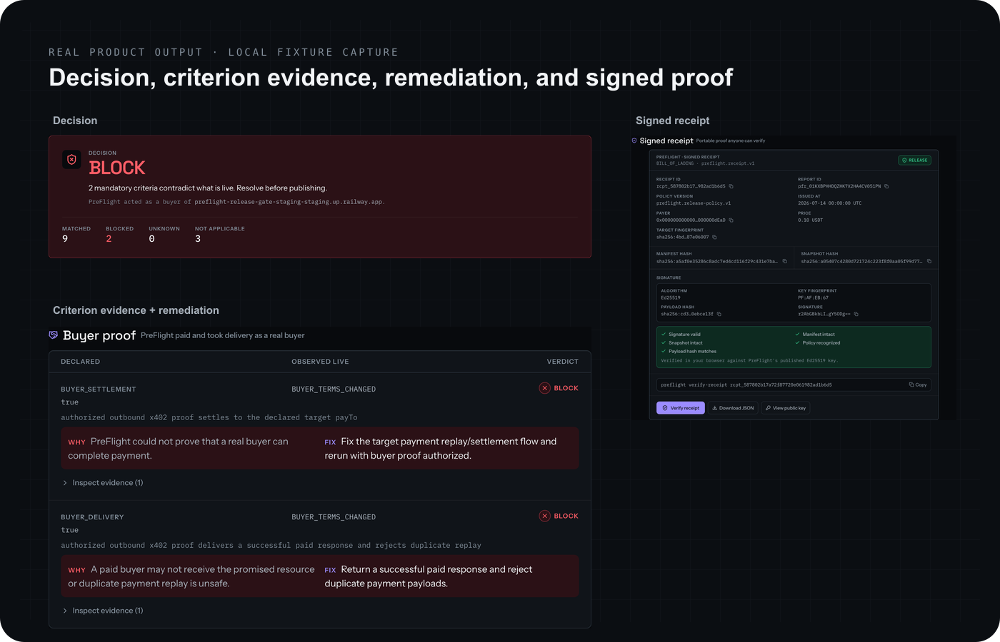
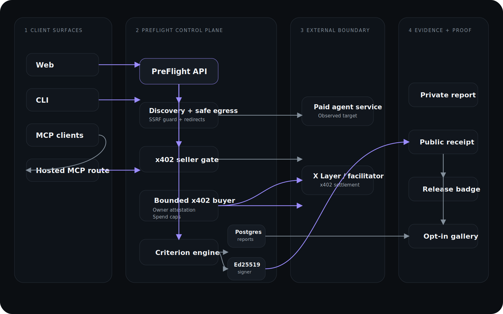

<div align="center">
  

  <h1>PreFlight</h1>

  <p><strong>Your first real customer before launch.</strong></p>

  <p>
    PreFlight discovers what a paid agent service actually exposes, optionally completes a bounded real payment, verifies settlement and delivery, and returns RELEASE, BLOCK, or UNKNOWN with criterion-level evidence, remediation, and signed proof.
  </p>

  <p>
    <a href="https://usepreflight.xyz">Launch PreFlight</a>
    ·
    <a href="docs/api.md">Documentation</a>
    ·
    <a href="https://api.usepreflight.xyz/api/v1/service">Hosted API</a>
    ·
    <a href="https://www.npmjs.com/package/@vinaystwt/preflight-cli">npm CLI</a>
  </p>

  <p>
    <a href="https://github.com/Vinaystwt/preflight/actions/workflows/ci.yml"></a>
    <a href="https://www.npmjs.com/package/@vinaystwt/preflight-cli"></a>
    =20" src="https://img.shields.io/badge/node-%3E%3D20-9B8CFF">
    
    
  </p>

  <p><sub>Source is publicly available for review. No license for reuse, modification, or redistribution is granted unless stated otherwise.</sub></p>
</div>



## A service can be online and still be unbuyable

Health checks do not prove that a paid agent service works for a real customer.

A service can respond successfully while its live contract advertises the wrong price, network, asset, or payee. Payment can settle while delivery fails. Declared behavior can drift from production. A generic score can hide the exact issue blocking release.

PreFlight tests the buyer journey before customers discover the failure.

- Contract drift between what was declared and what is live
- Incorrect payment challenge terms
- Successful settlement followed by failed delivery
- Duplicate-payment or replay inconsistencies
- Missing evidence and unclear remediation

## How PreFlight works

PreFlight separates free discovery from paid release verification. Nothing is charged until the developer confirms the discovered contract and starts the full check.



1. Submit a public endpoint.
2. Discover the live service contract.
3. Review a proposed manifest with provenance.
4. Confirm the release check and complete the x402 payment.
5. Optionally authorize bounded buyer proof against the target service.
6. Receive a decision, criterion evidence, remediation, and a signed receipt.

## What PreFlight verifies

| Surface | What is checked |
| --- | --- |
| Discovery | What the endpoint actually exposes over HTTPS, MCP, and payment challenges |
| Contract integrity | Whether price, network, asset, payee, and declared behavior match production |
| Payment challenge | Whether the buyer receives coherent and actionable payment terms |
| Settlement | Whether the required payment state is actually reached |
| Delivery | Whether the service returns the promised result after payment |
| Replay behavior | Whether repeated payment or delivery attempts behave safely |
| Evidence | Whether each criterion is supported by an observable fact rather than a generic score |

## Decisions you can ship against

| Decision | Meaning |
| --- | --- |
| `RELEASE` | Mandatory criteria match the declared release and no blocking contradiction was observed. |
| `BLOCK` | At least one mandatory criterion contradicts the release. |
| `UNKNOWN` | PreFlight could not safely prove the criterion either way. Unknown is honest; it is never silently upgraded. |

Each decision is built from criterion-level states:

- `MATCH` — observed production behavior matches the declaration
- `CONTRADICTION` — observed production behavior conflicts with the declaration
- `UNKNOWN` — there is not enough safe evidence
- `NOT_APPLICABLE` — the criterion does not apply to this surface



_Real product output: verdict, criterion evidence, remediation, and signed proof._

## Key capabilities

- **Discovery-first input** — start with a public endpoint rather than a hand-authored manifest.
- **Proposed manifest with provenance** — inferred fields show where they came from and whether confirmation is required.
- **Bounded buyer proof** — with owner attestation and spend limits, PreFlight can pay and take delivery like a real customer.
- **Deterministic verdicts** — RELEASE, BLOCK, or UNKNOWN from criterion states, not an opaque aggregate score.
- **Actionable remediation** — contradictions include observed evidence and the exact issue to fix.
- **Signed receipts** — Ed25519 signatures over canonical JSON, verifiable outside the report page.
- **Private reports** — bearer capability tokens protect non-public report data.
- **Agent-native access** — use the hosted API, MCP endpoint, or npm CLI.
- **Portable proof** — opt-in badges and gallery entries expose only approved release evidence.

## Use PreFlight your way

| Surface | Best for | Entry point |
| --- | --- | --- |
| Web | Interactive discovery and human-readable reports | `https://usepreflight.xyz` |
| API | Programmatic release checks | `https://api.usepreflight.xyz` |
| MCP | Agent-native discovery and verification | `https://api.usepreflight.xyz/mcp` |
| CLI | Local workflows and CI integration | `@vinaystwt/preflight-cli` |

#### Web

Open https://usepreflight.xyz, paste a public endpoint, and review the proposed manifest. Discovery is free. A full release verification costs 0.10 USDT.

#### API

```bash
curl -s https://api.usepreflight.xyz/api/v1/service | jq
curl -s https://api.usepreflight.xyz/api/v1/contracts/release-manifest/v1 | jq
```

POST /api/v1/verify-release is the paid x402 release-check endpoint. An unpaid request returns a payment challenge; a funded client replays the request with the required payment proof.

See [docs/api.md](docs/api.md).

#### MCP

```json
{
  "mcpServers": {
    "preflight": {
      "url": "https://api.usepreflight.xyz/mcp"
    }
  }
}
```

CLI installation is not required for the hosted MCP service.

See [docs/mcp.md](docs/mcp.md).

#### CLI

```bash
npm install -g @vinaystwt/preflight-cli
preflight --help
preflight verify --help
preflight verify-receipt --help
npx @vinaystwt/preflight-cli --help
```

See [docs/cli.md](docs/cli.md).

## Architecture

PreFlight keeps discovery, payment verification, bounded buyer execution, criterion evaluation, report storage, and receipt signing as explicit trust boundaries.



Web, CLI, and MCP clients call the Fastify API. Discovery uses guarded egress to inspect public services. The seller gate verifies payment to PreFlight, while bounded buyer execution can independently pay the target service. A deterministic criterion engine writes private reports and signs portable receipts with Ed25519.

See [docs/architecture.md](docs/architecture.md).

## Signed receipts

Every completed verification can issue a portable receipt:

- canonical JSON with sorted keys;
- SHA-256 payload hash;
- Ed25519 signature;
- public verification keys at `GET /api/v1/pubkeys`;
- public receipt lookup at `GET /api/v1/receipts/{receipt_id}`.

See [docs/receipts.md](docs/receipts.md) and [docs/cli.md](docs/cli.md).

## Security and trust boundaries

PreFlight is a verifier, not a custody product.

- Private reports require bearer capability tokens.
- Reports are published only after the required settlement state.
- Probe egress rejects private/internal targets and unsafe redirects.
- Bounded buyer proof requires owner attestation and spend caps.
- Terms-hash drift aborts buyer proof before payment.
- Seller, buyer, and operational wallets are separated by role.
- Ambiguous evidence returns UNKNOWN rather than a false release.

See [docs/security.md](docs/security.md).

<details>
<summary><strong>Local development</strong></summary>

Backend:

```bash
npm ci
npm run typecheck
npm run build
npm test -- --run
npm run migrate
npm start
```

Web:

```bash
cd web
npm ci
npm run lint
npm run build
npx tsc --noEmit
npx playwright test --reporter=list
```

CLI:

```bash
npm run build --prefix packages/cli
(cd packages/cli && npm pack --dry-run)
```

</details>

<details>
<summary><strong>Project structure</strong></summary>

```text
src/                 Fastify API, MCP, release criteria, payments, receipts
src/db/migrations/   Additive database migrations
web/                 Next.js web application
packages/cli/        Published CLI source
docs/                API, MCP, receipt, security, architecture, and deployment docs
test/                Backend and release-gate tests
```

</details>

## Status and limitations

- Agent ID resolution is intentionally conservative unless an authoritative listing resolver is configured.
- Gallery entries are opt-in.
- Chain anchoring is disabled unless explicitly configured and proven.
- Browser receipt verification may fall back honestly if local Ed25519 support is unavailable.
- The CLI is published as `@vinaystwt/preflight-cli@0.1.0`; documented commands are limited to verified registry behavior.

## License

No public license has been selected. Do not assume rights to reuse, modify, or redistribute the source unless a license is added.
