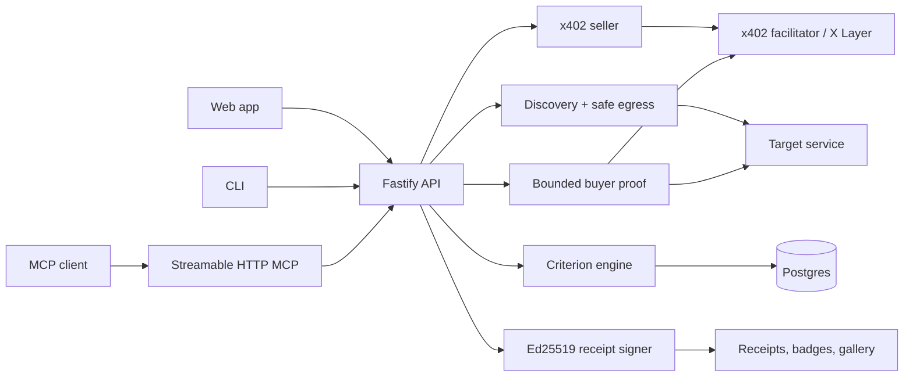

# Architecture

PreFlight is a Fastify backend, a hosted Next.js web app, a hosted MCP endpoint, and a small CLI package.

The release decision is deterministic for a given observed snapshot and manifest. The service prefers explicit `UNKNOWN` states over unsafe inference.
